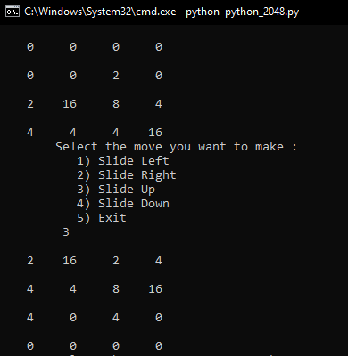

# 2048_Python
- Here I have developed one of the most famous single player game - 2048, by making the use of my Python 3 skills and by not importing an single external packages like numpy or pandas.
- The complete code in written in pure Python 3 Vanilla.

## Features :
- It has two sizes of game board.
  - 4 X 4 and
  - 8 X 8
 - It has two modes/levels to win.
    - 2048 and
    - 4096
  - Very easy to play and undedstand.
  - No browser or application is required, it works on console window.
  
  ## Requirements :
    - Python 3
    - Brain (Just Joking ;-) )
    
   ## Instructions to play :
   
   1. Clone this repository to your local system.
   2. Open Command Prompt/ Shell/ Bash from the folder location of this repository.
   3. Type this command to play this game in the console window, `python python_2048.py`
   4. Then you will be asked to chose you'r preferred game board size.
   
   
   
   5. The you will be asked to chose the win objective.
   
   
   
   6. The game will get started and you will be provided with the options of possible moves.
   
   
   
   7. This is how to select possible moves :
   
      7.1. Slide Left
      
      
      
      7.2. Slide Right
      
      
      
      7.3. Slide Upwards
      
      
      
      7.4. Slide Downwards
      
      
      
      7.5 Exit from the game
      
      
     
 8. If the move you played does not make any change on the board, it will be considered as Invalid Move and you will need to replay the move.
    
 
    
 9. All the best for you win !!
    
 
    
 10. Never let go and retry if you lose.
    
 
      
